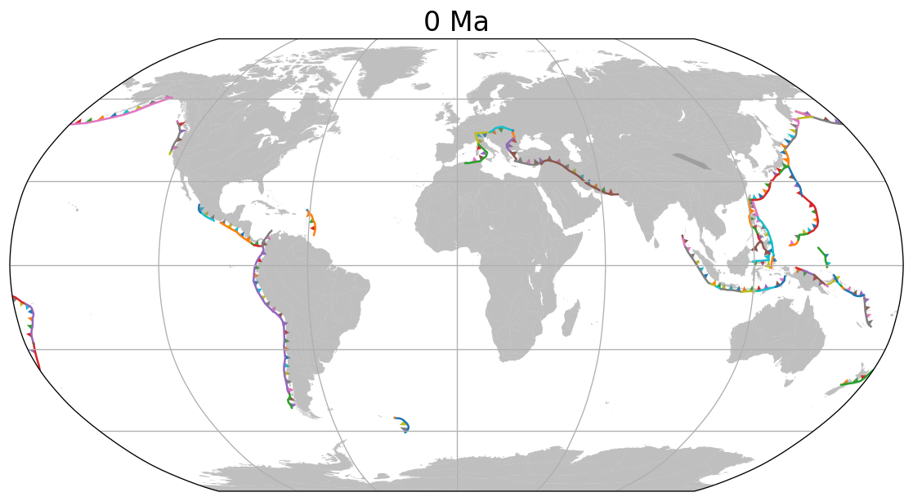

If you are using Python, check out our GPlates Web Service Python proxy at https://github.com/michaelchin/gplates-python-proxy#readme.

The following code reconstructs three locations back to 100Ma using "Muller2019" model. You need to `pip install gplates-ws-proxy` before running the code.

```python
  # pip install gplates-ws-proxy
  import shapely
  from gplates_ws_proxy import PlateModel, reconstruct_shapely_points

  lats = [50, 10, 50]
  lons = [-100, 160, 100]
  points = [shapely.Point(x, y) for x, y in zip(lons, lats)]

  model = PlateModel("Muller2019")
  paleo_points = reconstruct_shapely_points(model, points, 100)
  print(paleo_points)
```

Here is another example. The subduction zones and coastlines in the image below was plotted 
by [plot_subduction_zones.py](https://github.com/michaelchin/gplates-python-proxy/blob/main/examples/plot_subduction_zones.py).



Check out **more Python examples** at https://github.com/michaelchin/gplates-python-proxy/tree/main/examples#readme.