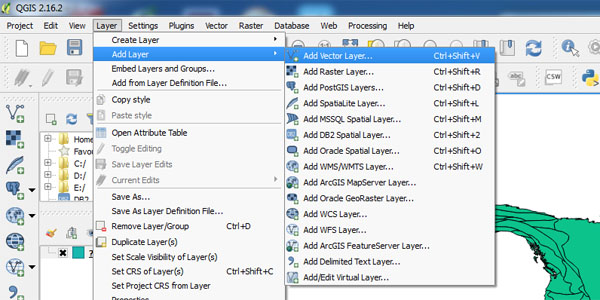
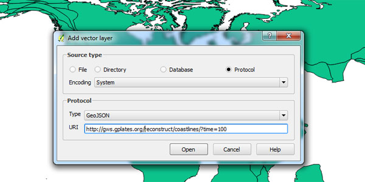
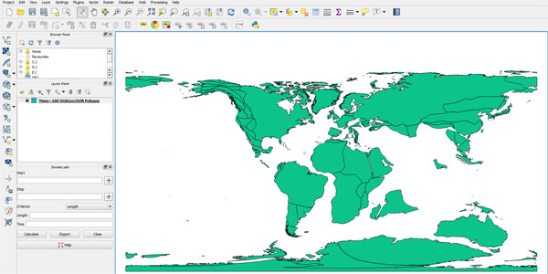

- **Step 1**: Click menu item "Layer-->Add Layer-->Add Vector Layer"

- **Step 2**: In the popup dialog, choose "Protocol" as "Source Type" and type in the URI, for example "https://gws.gplates.org/reconstruct/coastlines?time=100"

- **Step 3**: Click "Open" button and the reconstructed coastlines will show in QGIS

                        