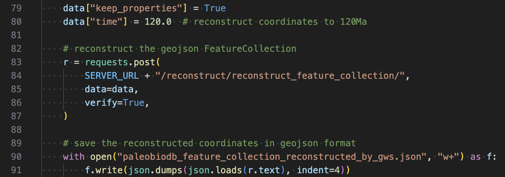
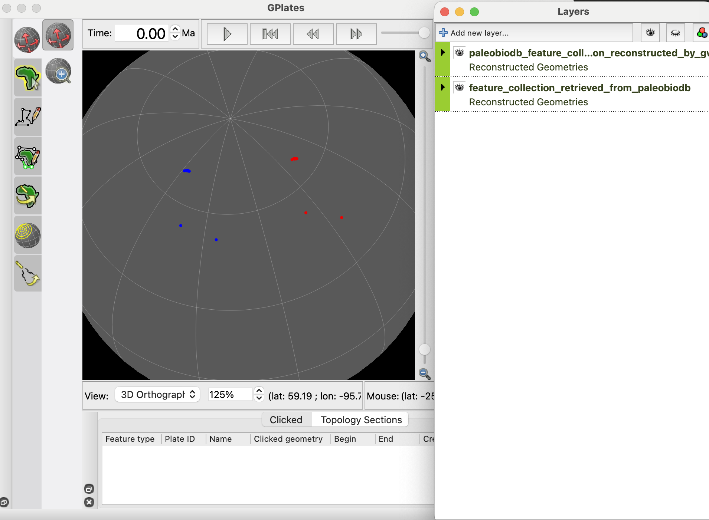
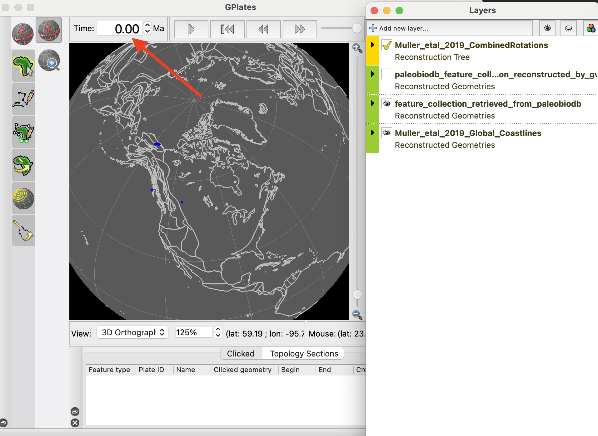
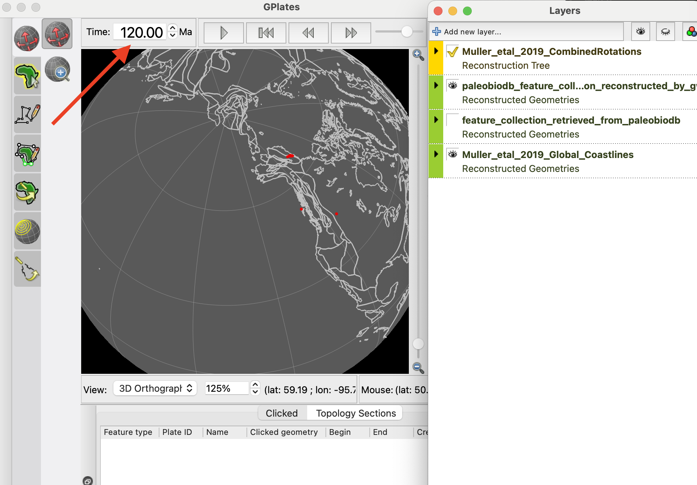

The Python code in [paleobiodb.py](https://github.com/GPlates/gplates-web-service/blob/master/examples/paleobiodb.py) demonstrates how the GWS can be used to get the paleo-coordinates for the data from http://paleobiodb.org/.

_clicking the screenshot above will take you to the full source code of this example at https://github.com/GPlates/gplates-web-service/blob/master/examples/paleobiodb.py_

The steps in the workflow:

- step 1: get 10 unique coordinates from http://paleobiodb.org/ (_for demonstration purpose only_)
- step 2: build a geojson feature collection from the data in step 1
- step 3: send the geojson feature collection to GWS 
- step 4: the GWS returns a new geojson feature collection with the paleo-coordinates
- step 5: save the the present-day coordinates and paleo-coordinates to .json files
- step 6: check the coordinates in [GPlates](https://www.gplates.org) desktop software

 

**Fig 1.** the figure shows the present-day coordinates in Blue and paleo-coordinates at 120Ma in Red.

**Fig 2.** the figure shows the present-day coordinates along with the present-day coastlines.

**Fig 3.** the figure shows the paleo-coordinates at 120Ma along with the paleo-coastlines.

