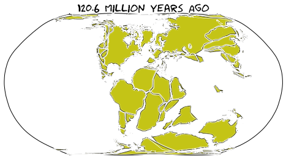

These pages provide documentation for users of the gplates web service API.

The pages here describe:
- the API functions
- the different reconstruction models and data files that can be accessed through the service

# GPlates Web Service
The **GPlates Web Service** is a part of the on-going GPlates project funded by [AuScope](https://www.auscope.org.au/). 
The web service is built upon [pygplates](https://www.gplates.org/docs/pygplates/index.html). 
It allows users to utilize the pygplates functionalities without installing pygplates locally. 
Users can send HTTP requests to https://gws.gplates.org to get the reconstruction results back. 
This enables pygplates functionalities in any programming languanges and on any operation systems.

The web serivce is also containerized(https://hub.docker.com/r/gplates/gws). Users can choose to deploy the [Docker](https://www.docker.com/) containers locally 
to enhance performance and data security. 

The GPlates Web Service is created and maintained by [EarthByte](https://www.earthbyte.org) group at the [University of Sydney](https://www.sydney.edu.au/).

# Demos in the D3.js Maps
- [Reconstruct Points](https://portal.gplates.org/service/d3_demo/?view=points)
- [Reconstruct Feature Collection](https://portal.gplates.org/service/d3_demo/?view=points)
- [Reconstruct Coastlines](https://portal.gplates.org/service/d3_demo/)

# EarthByte Group
[EarthByte](https://www.earthbyte.org) group is an internationally leading eGeoscience collaboration between several Australian Universities, 
international centres of excellence and industry partners. One of the fundamental aims of the EarthByte Group 
is geodata synthesis through space and time, assimilating the wealth of disparate geological and geophysical data 
into a four-dimensional Earth model including tectonics, geodynamics and surface processes. The EarthByte Group is 
pursuing open innovation via collaborative software development, high performance and distributed computing, 
“big data” analysis and by making open access digital data collections available to the community.

# Contact Us
You are welcome to contact us at https://www.earthbyte.org/contact-us-3/.

# Acknowledgement

This website is built upon [gatsby-gitbook-starter](https://www.gatsbyjs.com/starters/hasura/gatsby-gitbook-starter/).
We thank https://www.gatsbyjs.com/ and https://hasura.io/.