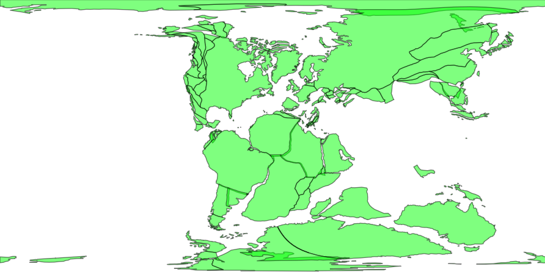
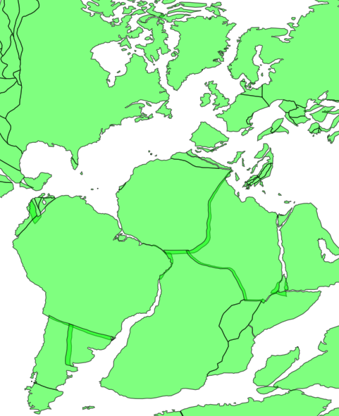

## Reconstruct Coastlines

**Description:**

http GET request to retrieve reconstructed coastline polygons

**Endpoint:**
    
    https://gws.gplates.org/reconstruct/coastlines/
    
**Parameters:**

*anchor_plate_id* : integer value for reconstruction anchor plate id [default=0]

*time* : time for reconstruction [required]

*model* : name for reconstruction model [defaults to default model from web service settings]

*fmt* : if set this parameter to "png", this function will return a png image

*facecolor* : such as "black", "blue", etc

*edgecolor* : such as "black", "blue", etc

*alpha* : such as 1, 0.5, etc

*extent* : such as extent=-180,180,-90,90

*central_meridian* : central meridian -- useful when wrap to dateline and plot png map

*wrap* flag to indicate if wrap the coastlines along dateline, true or false

**Returns:**

GeoJSON/PNG data containing reconstructed coastline features

**Examples:**

**&#128994; E1:** Reconstruct the coastlines back to 140Ma using [SETON2012](https://github.com/GPlates/gplates_web_service_doc/wiki/Reconstruction-Models#seton2012) model.

<https://gws.gplates.org/reconstruct/coastlines/?&time=140&model=SETON2012>

See the result in an [interactive map](https://portal.gplates.org/service/d3_demo/).

**&#128994; E2:** Return a png map <https://gws.gplates.org/reconstruct/coastlines/?&time=140&model=SETON2012&fmt=png&facecolor=lime&edgecolor=black&alpha=0.5>

**&#128994; E3:** Return a png map within an extent <https://gws.gplates.org/reconstruct/coastlines/?&time=140&model=SETON2012&fmt=png&facecolor=lime&edgecolor=black&alpha=0.5&extent=-50,50,-50,50>

