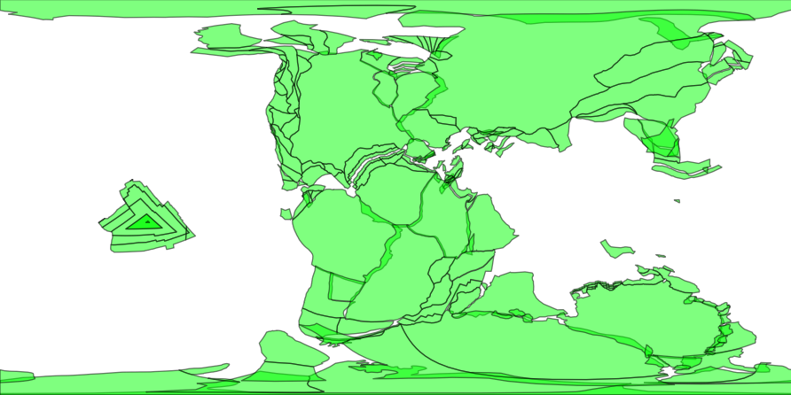
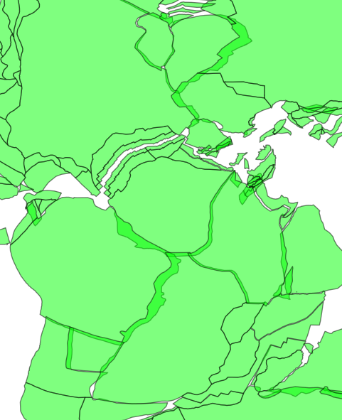

## Reconstruct Static Plate Polygons

HTTP GET request to retrieve reconstructed static plate polygons

**Endpoint**:
    
    https://gws.gplates.org/reconstruct/static_polygons
    
**Parameters**:

- ***anchor_plate_id*** : integer value for reconstruction anchor plate id [default=0]

- ***time*** : geologic time(Ma) [required]

- ***model*** : the [reconstruction model](/models) name (if not specified, will use the [default model](/models#defaultmodel))

- ***fmt*** : if set this parameter to "png", this function will return a png image

- ***facecolor*** : such as "black", "blue", etc

- ***edgecolor*** : such as "black", "blue", etc

- ***alpha*** : such as 1, 0.5, etc

- ***extent*** : such as extent=-20,20,-20,20

**Return**:

GeoJSON/PNG data containing reconstructed static plate polygons.

**Examples:**

**&#128994; E1:** Reconstruct the static plate polygons back to 100Ma using [ZAHIROVIC2022](/models#zahirovic2022) model.

**Click this [link](https://gws.gplates.org/reconstruct/static_polygons/?time=100&model=ZAHIROVIC2022) to try this example in a web browser.**

Alternatively, use curl command.

```shell
curl "https://gws.gplates.org/reconstruct/static_polygons/?time=100&model=ZAHIROVIC2022"
```

**&#128994; E2:** Return a PNG map for the whole world

**Click this [link](https://gws.gplates.org/reconstruct/static_polygons/?&time=140&model=ZAHIROVIC2022&fmt=png&facecolor=lime&edgecolor=black&alpha=0.5) to try this example in a web browser.**

Alternatively, use curl command.

```shell
curl --output static-polygons.png "https://gws.gplates.org/reconstruct/static_polygons/?&time=140&model=ZAHIROVIC2022&fmt=png&facecolor=lime&edgecolor=black&alpha=0.5"
```



**&#128994; E3:** Return a PNG map within an extent 

**Click this [link](https://gws.gplates.org/reconstruct/static_polygons/?&time=140&model=ZAHIROVIC2022&fmt=png&facecolor=lime&edgecolor=black&alpha=0.5&&extent=-50,50,-50,50) to try this example in a web browser.**

Alternatively, use curl command.

```shell
curl --output static-polygons.png "https://gws.gplates.org/reconstruct/static_polygons/?&time=140&model=ZAHIROVIC2022&fmt=png&facecolor=lime&edgecolor=black&alpha=0.5&&extent=-50,50,-50,50"
```


