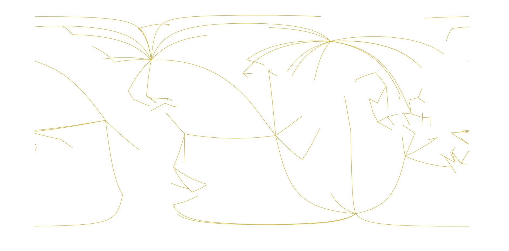

## Reconstruction Tree Map

http GET request to retrieve a geographical representation of a reconstruction hierarchy

**Endpoint:**

    https://gws.gplates.org/rotation/reconstruction_tree_map

**Parameters:**

*time* : time for reconstruction tree [required]

*model* : name for reconstruction model [defaults to default model from web service settings]

**Returns:**

json containing reconstructed feature collection with a geometry representing the rotation hierarchy in a
geographical arrangement

**Examples:** 

**&#128994; E1:** get the reconstruction tree map at 100Ma

<https://gws.gplates.org/rotation/reconstruction_tree_map?time=100>

If we plot the returned GeoJSON file in QGIS, the map look like this.
Each line represent an "edge" of the reconstruction tree with one vertex is the "moving plate id"
and the other vertex is the "fixed plate id".

